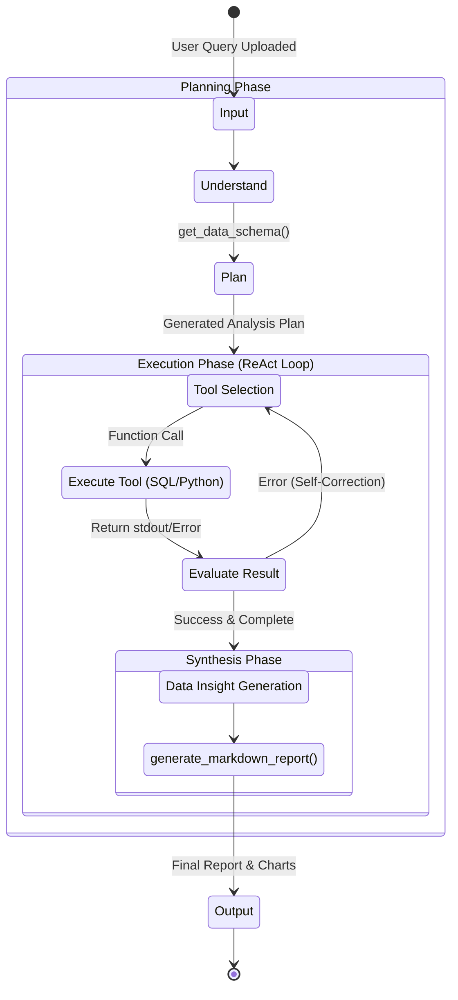
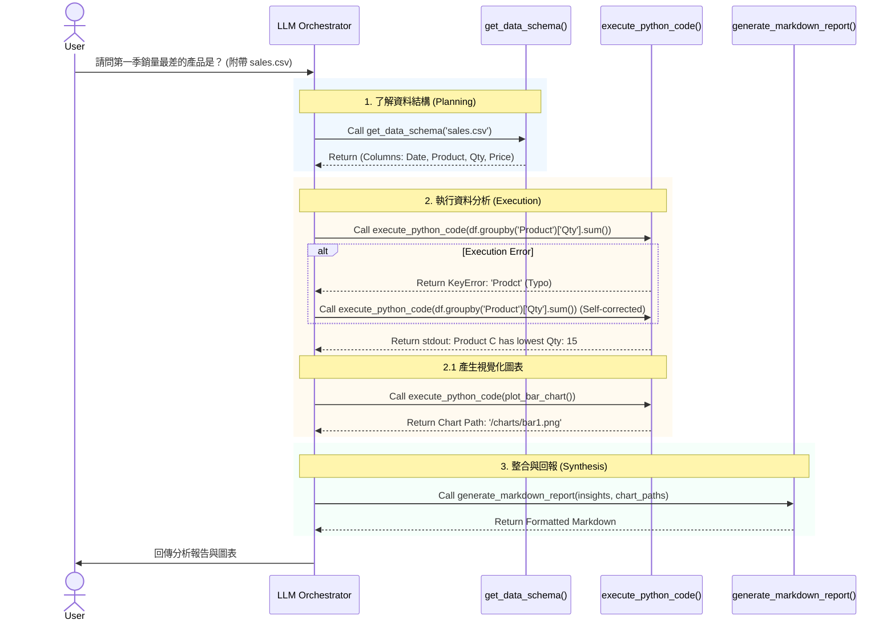

# 資料分析代理 (Data Analysis Agent) 資訊圖表

本文件透過視覺化圖表呈現 AI Harness 的系統設計，包含系統架構、工作流程與 Function Calling 呼叫流程。

## 1. 系統架構圖 (System Architecture)
呈現 LLM, Memory, Tools 與執行環境之間的關係與資料流向。

```mermaid
graph TD
    User([User]) -- "Natural Language Query\n(e.g., 分析銷售趨勢)" --> Interface

    subgraph AI Harness System [AI Harness System (System Controller)]
        Interface[Chat Interface]
        LLM{LLM Orchestrator\n(GPT-4 / Gemini)}
        
        subgraph Memory
            STM[(Short-term Memory)\n- Context\n- Error Logs\n- State]
            LTM[(Long-term Memory)\n- Data Schemas\n- User Preferences]
        end
        
        Interface <--> LLM
        LLM <--> STM
        LLM <--> LTM
    end

    subgraph Tools Layer [Tools Layer / Function Calling]
        T_Schema[get_data_schema]
        T_SQL[execute_sql_query]
        T_Python[execute_python_code]
        T_Report[generate_markdown_report]
    end

    subgraph Sandbox Environment [Sandbox / Execution Environment]
        DB[(SQL Database)]
        REPL[Python REPL\n(Pandas, Matplotlib)]
    end

    LLM -- "Selects & Calls" --> T_Schema
    LLM -- "Selects & Calls" --> T_SQL
    LLM -- "Selects & Calls" --> T_Python
    LLM -- "Selects & Calls" --> T_Report

    T_Schema --> DB
    T_SQL --> DB
    T_Python --> REPL
```

## 2. 代理工作流程圖 (Agent Workflow Flowchart)
呈現 Plan-and-Execute 的多步驟任務執行邏輯。



## 3. Function Calling / Tool Chain 循序圖 (Sequence Diagram)
詳細展示在一次分析請求中，各組件間的呼叫順序與資料傳遞。


